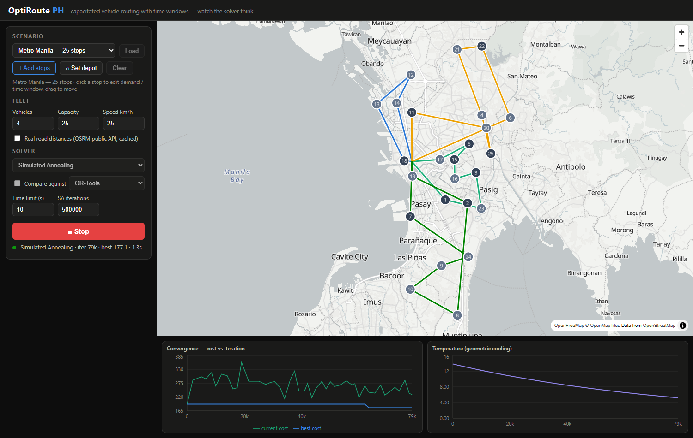
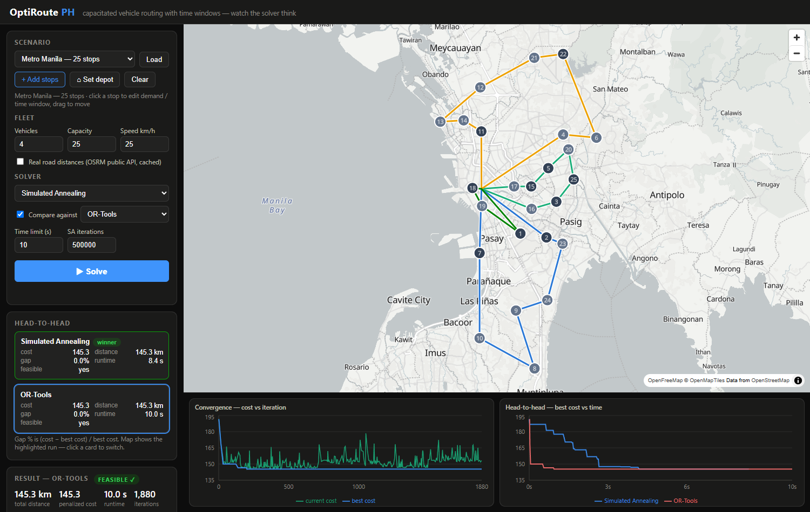
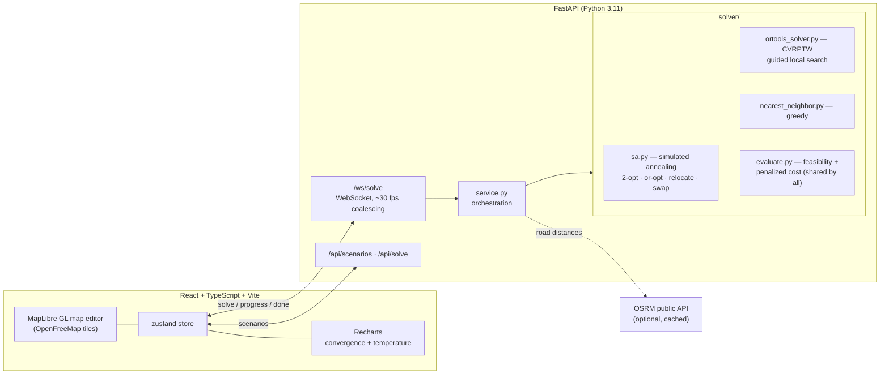

# OptiRoute PH

**Watch a real optimization solver converge, live, on a map of the Philippines.**

Drop delivery stops anywhere on the map, set vehicle capacities and time windows, hit
*Solve*, and watch colored routes untangle themselves in real time while a convergence
chart streams the solver's progress. The centerpiece is a from-scratch **simulated
annealing** implementation for the capacitated vehicle routing problem with time windows
(CVRPTW) that matches — and on the 50-stop scenario, beats — Google OR-Tools under the
same 10-second budget.


*Mid-anneal on the Metro Manila scenario: routes still tangled, current cost (green)
bouncing over the incumbent (blue), temperature descending on schedule.*

> 🎞️ *GIF of the live convergence animation goes here — record with the Metro Manila
> scenario, SA, 10 s limit.*

## Features

- **Map editor** — click to add auto-numbered stops, drag to move them, click a stop to
  set demand / service time / delivery time window in a popover, drag the depot anywhere.
  Three preloaded scenarios: Metro Manila (25 stops), Laguna (15 stops), Random (50 stops).
- **Three solvers** — from-scratch simulated annealing, Google OR-Tools (guided local
  search), and a nearest-neighbor greedy baseline.
- **Live streaming** — every improvement is pushed over a WebSocket
  (`{iteration, temperature, best_cost, current_cost, routes}`) and drawn immediately:
  polylines re-arrange, the convergence chart grows, the SA temperature curve cools.
- **Comparison mode** — run two algorithms head-to-head on the same instance; side-by-side
  final cost, gap %, runtime, and a best-cost-vs-time overlay chart.
- **Results** — per-route breakdown (visit order, load vs capacity, distance, duration,
  time-window violations with arrival times), export as GeoJSON or CSV.
- **Distances** — haversine by default; optional real road distances via the OSRM public
  API (responses cached on disk).



## Quick start

One command (bootstraps the venv and node_modules on first run, then starts both services):

```bash
python run.py    # backend on :8000 (or next free port), UI on :5173 — Ctrl+C stops both
```

Or by hand:

```bash
# backend (Python 3.11+)
cd backend
python -m venv .venv
source .venv/Scripts/activate    # Git Bash on Windows · source .venv/bin/activate on Unix
pip install -r requirements.txt
uvicorn app.main:app --port 8000

# frontend (Node 20+), second terminal
cd frontend
npm install
npm run dev          # http://localhost:5173  (proxies /api and /ws to :8000)
```

Or with Docker:

```bash
docker compose up --build   # frontend on http://localhost:5173
```

If port 8000 is taken locally: `uvicorn app.main:app --port 8001` and
`BACKEND_URL=http://localhost:8001 npm run dev`.

## Architecture



Every solver is priced by the **same evaluator** (`evaluate.py`) on the same distance
matrix, so streamed costs and final comparisons are apples to apples — OR-Tools' internal
objective is never trusted, its routes are re-evaluated.

## The Mathematics

### Problem: CVRPTW

Given depot $0$ and stops $\{1,\dots,n\}$ with demands $q_i \ge 0$, service times $s_i$,
optional time windows $[e_i, \ell_i]$, a homogeneous fleet of $m$ vehicles with capacity
$Q$, and a distance matrix $d_{ij}$ (haversine or OSRM road distance), find routes — one
tour per vehicle, each starting and ending at the depot — that visit every stop exactly
once. With binary decision variables $x_{ijk}$ (vehicle $k$ traverses arc $i\!\to\!j$)
and arrival-time variables $a_i$:

$$
\min \sum_{k=1}^{m}\sum_{i=0}^{n}\sum_{j=0}^{n} d_{ij}\, x_{ijk}
$$

subject to

$$
\sum_{k}\sum_{i} x_{ijk} = 1 \quad \forall j \ne 0
\qquad\text{(every stop entered exactly once)}
$$

$$
\sum_{i} x_{ihk} = \sum_{j} x_{hjk} \quad \forall h, k
\qquad\text{(flow conservation per vehicle)}
$$

$$
\sum_{i \ne 0} q_i \sum_{j} x_{ijk} \le Q \quad \forall k
\qquad\text{(capacity)}
$$

$$
x_{ijk} = 1 \;\Rightarrow\; a_j \ge \max(a_i,\, e_i) + s_i + t_{ij}
\qquad \forall\, i,\ \forall\, j \ne 0,\quad a_0 = 0
\qquad\text{(time propagation, } t_{ij} = d_{ij}/v\text{)}
$$

$$
e_j \le \max(a_j, e_j) \le \ell_j \quad \forall j \ne 0 \text{ with a window}
\qquad\text{(service starts inside the window; early arrival waits)}
$$

Time propagation is quantified over arcs *into stops* only: $a_0$ is the fixed
departure time, and arcs returning to the depot are unconstrained (route duration is
not part of the objective, and the depot has no window). One arrival variable per stop
suffices because each stop is entered exactly once. The implication also eliminates
subtours: with $t_{ij} > 0$, arrival times increase strictly along every arc into a
stop, so a cycle visiting only stops would force $a_j > a_j$ — the classic MTZ-style
trick, which is why no exponential family of subtour constraints is needed.

CVRPTW is NP-hard (it contains the TSP as the $m{=}1$, $Q{=}\infty$, no-windows special
case), so past a few dozen stops exact methods give way to heuristics.

### The search objective

Metaheuristics need a connected search space: a chain of *feasible-only* solutions
between two good solutions often doesn't exist. So the annealer minimizes a penalized
objective over the space of *all* route assignments:

$$
f(S) \;=\; D(S) \;+\; \lambda_{\text{cap}}\, Q^{+}(S) \;+\; \lambda_{\text{tw}}\, W(S)
$$

where $D$ is total distance (km), $Q^{+}$ total capacity excess, and $W$ total lateness
in minutes ($\lambda_{\text{cap}} = 50$, $\lambda_{\text{tw}} = 2$ — one overloaded
demand unit ≈ 50 km of driving, large enough to dominate any distance saving available
at city scale, small enough to keep the cost surface informative rather than cliff-like).
Early arrival is free: the vehicle waits for the window to open, per standard CVRPTW
semantics.

### Simulated annealing

SA (Kirkpatrick, Gelatt & Vecchi, 1983) is stochastic local search that escapes local
minima by accepting some *worsening* moves. From current solution $S$, propose a random
neighbor $S'$ and accept with the **Metropolis probability**

$$
P(\text{accept}) =
\begin{cases}
1 & \Delta \le 0 \\
e^{-\Delta / T} & \Delta > 0
\end{cases}
\qquad \Delta = f(S') - f(S).
$$

At fixed $T$, the induced Markov chain has stationary distribution
$\pi_T(S) \propto e^{-f(S)/T}$ (the Boltzmann distribution), which concentrates on
global minimizers as $T \to 0$ — the reason this acceptance rule and not some other
sigmoid.

**Neighborhood** (uniform random position, kind sampled 30/20/30/20):

| move | scope | what it fixes |
|---|---|---|
| 2-opt | intra-route | reverses a segment — removes crossings (Croes 1958) |
| or-opt | intra-route | relocates a chain of 1–3 stops (Or 1976) — "stranded stop" repair |
| relocate | inter-route | moves a chain of 1–3 stops to another vehicle — load balancing |
| swap | inter-route | exchanges two stops between vehicles |

With time windows, a change anywhere in a route shifts every downstream arrival, so
deltas are computed by re-evaluating the touched routes in full ($O(\text{route length})$,
honest and bug-resistant) rather than the $O(1)$ edge arithmetic of pure-TSP 2-opt.
The accumulated cost is resynced against a full evaluation every 10 000 iterations to
cancel floating-point drift.

**Cooling schedule.** Geometric in *budget consumption*:

$$
T(p) = T_0 \left(\tfrac{T_f}{T_0}\right)^{p},
\qquad p = \max\!\left(\tfrac{k}{K},\ \tfrac{\text{elapsed}}{\text{time limit}}\right)
$$

Iteration-bound runs get the classic $T_k = T_0\,\alpha^k$ with
$\alpha = (T_f/T_0)^{1/K}$; time-bound runs contract the schedule so the cooling arc
always *completes*. (Empirically: letting the wall clock truncate a fixed-$\alpha$
schedule mid-melt produced solutions worse than greedy on the 50-stop scenario —
see *Notes from tuning*.)

**Endpoint calibration** (Ropke & Pisinger 2006). Fixed temperatures would be wrong by
orders of magnitude across instances, so both endpoints are anchored to the initial
objective: choose $T$ so a solution $w\%$ worse than the start is accepted with
probability $\tfrac12$:

$$
T = \frac{(w/100)\, f(S_0)}{\ln 2},
\qquad w_{\text{start}} = 5,\quad w_{\text{end}} = 0.01 .
$$

The natural-looking alternative — set $T_0$ from the mean uphill delta of sampled moves
(Johnson et al. 1989) — fails here: with soft constraints the move-delta distribution is
bimodal (km-scale tweaks vs. penalty-scale jumps of $\lambda_{\text{cap}}$+), the mean
sits in the tail, and the schedule both starts *and ends* too hot to ever polish its
incumbent. Anchoring to a fraction of $f(S_0)$ is immune to the delta distribution's
shape.

**Warm start.** Nearest-neighbor construction, so the budget refines plausible solutions
instead of annealing a random permutation; $w_{\text{start}} = 5\%$ still provides enough
melt to leave the greedy basin.

**Why SA at all?** It is the simplest metaheuristic with a principled escape mechanism
and a convergence guarantee in the (impractical) logarithmic-schedule limit (Hajek 1988)
— which makes it the right showpiece: every design choice above is a formula with a
justification, not a vibe. The benchmark below is the check that the theory actually
cashes out.

### Empirical results

All three solvers on all three demo scenarios; identical haversine matrices; SA and
OR-Tools each capped at **10 s wall clock** (SA's iteration cap set high enough that
time is the binding constraint); SA run 5× (seeds 1–5) because it is stochastic.
Feasibility of every SA and OR-Tools solution is asserted, not assumed. Distances are
pure km (no penalties active in any reported solution). Ryzen 5 5600X, Python 3.12,
OR-Tools 9.x, 2026-07-11. Reproduce with
`backend/.venv/Scripts/python scripts/benchmark.py --time-limit 10 --sa-runs 5`.

| Scenario | Greedy (NN) | OR-Tools (10 s) | SA best of 5 | SA mean | SA best vs OR-Tools |
|---|---|---|---|---|---|
| Metro Manila — 25 stops | 191.66 km (0.1 ms) | 145.33 km | **145.33 km** | 145.70 km | **+0.0%** |
| Laguna — 15 stops | 241.96 km (0.0 ms) | 176.29 km | **176.29 km** | 176.29 km | **+0.0%** |
| Random — 50 stops | 418.93 km † (0.2 ms) | 265.17 km | **261.70 km** | 263.22 km | **−1.3%** |

† greedy ignores time windows; its random-50 solution violates them.

Reading: SA ties OR-Tools exactly on both structured scenarios (all five Laguna seeds
land on 176.29 km — very likely the optimum) and beats it on the 50-stop instance on
*every* seed (worst seed 264.45 km < 265.17 km). Greedy is 32–58% worse than OR-Tools
across the three instances (31.9% / 37.3% / 58.0%), which is the honest measure of what
the metaheuristics buy.

### Notes from tuning (what the charts caught)

Two real bugs were found *by watching the visualization*, which is rather the point of
this project:

1. **Mean-delta temperature calibration** put $T_f$ *above* the typical move delta —
   the temperature curve looked plausible, but the best-cost line went flat at the warm
   start on some seeds (the "final descent" was still accepting ~50% of uphill moves).
   Fix: anchor endpoints to $f(S_0)$, above.
2. **Wall-clock truncation of a fixed-$\alpha$ schedule** — the 50-stop run hit the 10 s
   limit at ~15% of its 5M-iteration schedule and returned a half-melted random walk,
   worse than greedy. Fix: cool by budget consumption, above.

## Testing

```bash
cd backend && .venv/Scripts/python -m pytest    # 47 tests
```

- **2-opt correctness** — exhaustive 2-opt descent from scrambled starts must reach the
  provably-optimal hull tour on points in convex position (5/7/10 stops), and must
  uncross a deliberately-crossed square.
- **Feasibility checker** — hand-computed instances (1 km = 1 min) verify distance,
  arrival times, waiting, lateness cascades, capacity excess, and visit-exactly-once.
- **Haversine** — known geodesics (Manila–Cebu ≈ 572 km, quarter meridian), small-distance
  numerical stability, symmetry, triangle inequality.
- **SA** — recovers the known-optimal tour on convex instances, never loses to its warm
  start, deterministic per seed, monotone incumbent stream, feasible on all demo scenarios.
- **API** — REST + WebSocket protocol round-trips, malformed-request handling.

## Project layout

```
backend/
  app/
    schemas.py            # Pydantic wire format (REST + WebSocket)
    scenarios.py          # the three demo instances
    service.py            # solver orchestration, result assembly
    main.py               # FastAPI app + /ws/solve streaming
    osrm.py               # OSRM table client with disk cache
    solver/
      model.py            # index-based instance, shared by all solvers
      distance.py         # haversine
      evaluate.py         # feasibility + penalized cost (single source of truth)
      moves.py            # 2-opt, or-opt, relocate, swap
      nearest_neighbor.py # greedy construction / SA warm start
      sa.py               # simulated annealing (the showpiece)
      ortools_solver.py   # OR-Tools CVRPTW wrapper
  tests/
frontend/
  src/
    components/           # MapView, SolverPanel, charts, results, comparison
    state/store.ts        # zustand app state + run orchestration
    lib/                  # api/ws client, exports, palette, formatting
scripts/benchmark.py      # produces the table above
benchmarks/results.json   # raw numbers from the run above
```

## License

MIT
